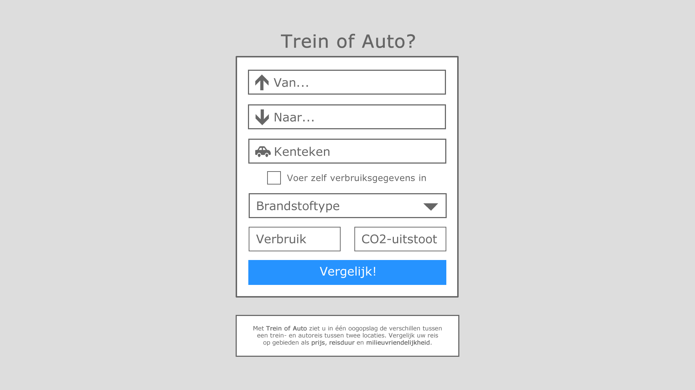
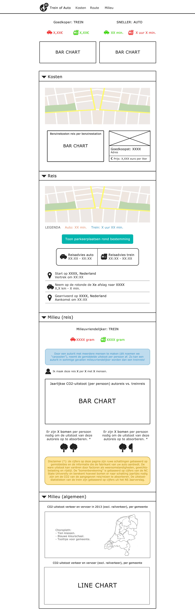
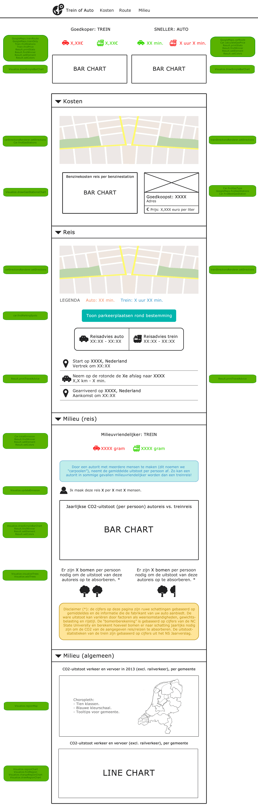

# Design document
Leon Kempers, 10626646.

## Minimum Viable Product
**Trein of Auto** kan bijna eindeloos uitgebreid worden en voor dit project zal ik proberen zoveel mogelijk features toe te voegen als mogelijk is in drie weken. Ik wil me echter eerst op de basis focussen. Voor het Minimum Viable Product van deze applicatie zijn de volgende features vereist:
* Een scherm waarin de gebruiker zijn begin- en eindbestemming kan ingeven (liefst verbonden met Google Maps).
* Code die de prijs van zowel de trein- als autoreis bepaalt.
* Code die de reistijd van zowel de trein- als autoreis bepaalt.
* Visualisaties die tonen wat de prijs en reistijd zijn en deze met elkaar vergelijken.

*Opmerking achteraf: al deze features zitten in het eindproduct, plus nog een stortvloed aan extra features. Denk hierbij aan benzinestations op de route, benzineprijzen per benzinestation, een uitgeschreven en gevisualiseerd reisadvies, CO2-uitstoot van de reis, de bomenvisualisatie, een kaartvisualisatie van de CO2-uitstoot per gemeente en de lijngrafiek behorende bij die kaart.*

## Framework mapping / classes
**Trein of Auto** gebruikt zowel PHP classes als JavaScript classes.

### PHP
De applicatie gebruikt een `Gas` PHP class voor alle functies die betrekking hebben op de benzine(prijzen). Ook is er een `Database` PHP class, die verbinding maakt met de MYSQL database.

### JavaScript
**Trein of Auto** gebruikt de volgende JavaScript classes:
* `Car`: Alle functies die enkel gebruikt worden voor de autoreis.
* `Train`: Alle functies die enkel gebruikt worden voor de treinreis.
* `Result`: Alle algemene functies, die gedeeld worden door de auto- en treinreis.
* `GoogleMaps`: Alle functies die gebruikmaken van de Google Maps API.
* `Visualize`: Alle functies die betrekking hebben op een grafiek, kaart of andere visualisatie.

## UI-schetsen
Ik heb mijn designschetsen tijdens het ontwikkelproces steeds bijgewerkt. De definitieve versies staan hieronder.

### Startpagina

### Resultatenpagina

### Resultatenpagina (incl. functies en classes)

## Frameworks
**Trein of Auto** gebruikt de volgende frameworks:

### CSS
* **[Semantic-UI] (http://semantic-ui.com/)**: Een Bootstrap-achtig framework met ingebouwde stijlen voor DOM-elementen.
** Noot: vereist tevens een JavaScript-bestand (`semantic.min.js`) voor enkele JS-functies.
* **[Font-Awesome] (https://fortawesome.github.io/Font-Awesome/)** en **[Ionicons] (http://ionicons.com/)**: Omdat duidelijke iconen veel effectiever werken dan tekst, gebruik waar mogelijk iconen in mijn applicatie. Deze iconen zijn afkomstig van Font-Awesome en Ionicons.

### JavaScript
* **[JQuery] (https://jquery.com/)**: Het bekende JavaScript framework, gebruikt om de code korter en overzichtelijker te maken.
* **[D3.JS] (http://d3js.org/)**: Om de complexere visualisaties in beeld te brengen.
** Uitgebreid met **[D3.tip] (https://github.com/Caged/d3-tip)** voor tooltips.
* **[Chart.JS] (http://www.chartjs.org/)**: Om de simpele bar charts in beeld te brengen.
** Dit framework vereist **[Moment.js] (http://momentjs.com/)** om data op de assen correct te formatteren.
* **[D3-Queue] (https://github.com/d3/d3-queue)**: Gebruikt bij de choropleth-visualisatie om de data asynchroon, maar na elkaar op te halen.
* **[Routeboxer.js] (http://google-maps-utility-library-v3.googlecode.com/svn/trunk/routeboxer/docs/examples.html)**: Maakt "boxen" rond een Google Maps-route; door kleine boxen te tekenen rond de autoroute, kan ik vervolgens met de Google Maps Places API (zie hieronder) benzinestations rond de autoroute vinden.
* **[TopoJSON.js] (https://github.com/mbostock/topojson)**: Zet het TopoJSON-bestand van de Nederlandse gemeenten om in een kaart die gevisualiseerd kan worden met D3.

### PHP
* **[Simple HTML DOM] (http://simplehtmldom.sourceforge.net/)**: Biedt handige functies om pagina's te parsen met PHP. Dit framework gebruik ik om de benzineprijzen te crawlen.

## Externe databronnen (API's en datasets)
**Trein of Auto** combineert data van veel verschillende bronnen. Het gebruikt daarvoor meerdere API's en datasets.

### API's
**Trein of Auto** gebruikt de volgende API's:
* **[RDW API] (https://www.rdw.nl/Zakelijk/Paginas/Open-data.aspx)** (JS): Deze API van 'Rijksdienst voor het Wegverkeer' laat mij de verbruiksgegevens van een auto opvragen (op basis van zijn kenteken).
* ~~**[NS API] (http://www.ns.nl/reisinformatie/ns-api)** (JS): Om de prijs en duur van de treinreis op te halen.~~ Deze API heb ik achteraf niet gebruikt, om redenen die ik beschreef in README.
* **[Google Maps Directions API] (https://developers.google.com/maps/)** (JS): Om de route, afstand en duur van de auto- en treinroute op te halen.
* **[Google Maps Places API] (https://developers.google.com/maps/)** (JS): Om de parkeerplaatsen rond de bestemming en de benzinestations op de route te vinden.
* **[Google Maps Geocoder API] (https://developers.google.com/maps/)** (JS): Om de lengte- en breedtecoördinaten van een locatie te vinden.

### Datasets
**Trein of Auto** combineert data van de volgende bronnen:
* **[Klimaatmonitor Databank] (http://www.klimaatmonitor.databank.nl/Jive/)**: Toont, voor elke gemeente van 2016, de CO2-uitstoot van verkeer en vervoer (exclusief railverkeer). Hoe ik met Pyton een tweede versie van deze dataset heb gemaakt voor mijn kaartvisualisatie, staat beschreven in het eindverslag.
* **[nederlandGemeenteTopo.json] (https://github.com/joosthoeks/D3.js-Choropleth-Mercator-Map/blob/master/data/nederlandGemeenteTopo.json)**: Dit TopoJSON-bestand bevat een kaart met alle Nederlandse gemeenten van 2014. Hoe ik dit bestand zelf heb bijgewerkt naar 2016, staat beschreven in het eindverslag.
* **[United Consumers] (https://www.unitedconsumers.com/tanken/informatie/brandstof-prijzen.asp)**: Helaas is er voor Nederland geen dataset of API waarmee de huidige brandstofprijs opgehaald kan worden. Daarom ben ik genoodzaakt deze prijs te crawlen van een webpagina. Voor mijn applicatie gebruik ik de pagina van United Consumers, omdat die de uitgebreidste informatie toont (namelijk ook de prijzen per benzinestation).
* **[OpenOV - NS-stations] (http://data.openov.nl/ns/)**: Hiermee kan ik de officiële afkorting van een stationsnaam ophalen.
* **[OpenOV - NS-tariefeenheden] (http://data.openov.nl/ns/)**: Deze matrix toont het aantal tariefeenheden tussen twee stations.
* **[NS - Tarieven 2016] (http://www.ns.nl/klantenservice/betalen/tarieven-consumenten-2016.html)**: Toont, voor elk aantal tariefeenheden, de bijbehorende prijs. Met behulp van deze tarieven kan ik, op basis van het aantal tariefeenheden, de prijs van een treinreis berekenen.

## Database-tabellen
Kleine datasets lees ik af uit CSV-bestanden, omdat dit sneller werkt dan SQL. Echter, om te voorkomen dat de benzineprijzenpagina bij elk prijsverzoek opnieuw gecrawld moet worden, crawl ik deze periodiek (één keer per uur). De resultaten sla ik vervolgens op in een MYSQL database, zodat ik deze vervolgens bij elk prijsverzoek eenvoudig kan ophalen. De MYSQL-database heeft de volgende kolommen:

**gas_prices**
* gas_type - varchar(16) - PRIMARY KEY
* average - decimal(4,3)
* bp - decimal(4,3)
* esso - decimal(4,3)
* shell - decimal(4,3)
* texaco - decimal(4,3)
* total - decimal(4,3)

De map `sql` bevat een SQL-exportbestand van de database.