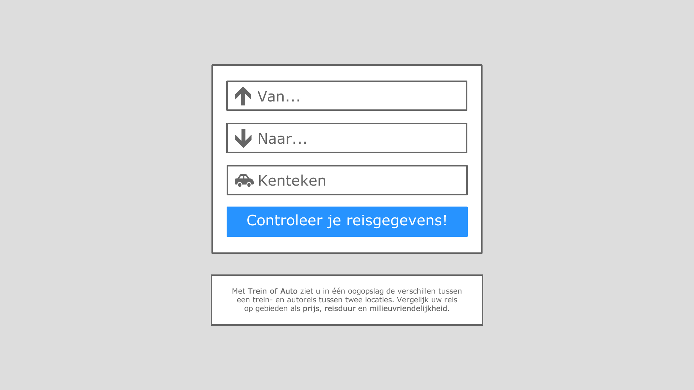
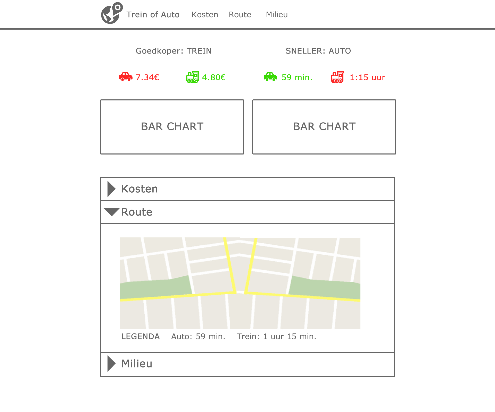

# Design document
Leon Kempers, 10626646.

# Minimum Viable Product
"Trein of auto" kan bijna eindeloos uitgebreid worden en voor dit project zal ik proberen zoveel mogelijk features toe te voegen als mogelijk is in drie weken. Ik wil me echter eerst op de basis focussen. Voor het Minimum Viable Product van deze applicatie zijn de volgende features vereist:
* Een scherm waarin de gebruiker zijn begin- en eindbestemming kan ingeven (liefst verbonden met Google Maps).
* Code die de prijs van zowel de trein- als autoreis bepaalt.
* Code die de reistijd van zowel de trein- als autoreis bepaalt.
* Visualisaties die tonen wat de prijs en reistijd zijn en deze met elkaar vergelijken.

# Framework mapping
Deze sectie beschrijft het framework van mijn applicatie.

## Classes
Ik zal een "Gas" PHP class gebruiken voor alle functies die betrekking hebben op de benzine(prijzen) en een “Database” PHP class om verbinding te maken met de MYSQL database. Ik weet nog niet of ik Javascript classes zal gebruiken.

## UI-schetsen

## Frameworks and API's
“Trein of auto” gebruikt de volgende frameworks:
* [D3.JS] (http://d3js.org/) (JS): Om de visualisaties in beeld te brengen.
* [Simple HTML DOM] (http://simplehtmldom.sourceforge.net/) (PHP): Biedt handige functies om pagina's te parsen met PHP. Ik zal deze gebruiken om de benzineprijzen te crawlen.

“Trein of auto” gebruikt de volgende API's:
* [RDW API] (https://www.rdw.nl/Zakelijk/Paginas/Open-data.aspx) (JS): deze API van 'Rijksdienst voor het Wegverkeer' zal ik gebruiken om de verbruiksgegevens op te vragen van een auto op basis van zijn kenteken.
* [Google Maps API] (JS) (https://developers.google.com/maps/): Om de afstand en duur van de auto- en treinroute op te halen.

## Databronnen
"Trein of Auto" combineert data van de volgende bronnen:
* [RDW] (https://www.rdw.nl/Zakelijk/Paginas/Open-data.aspx): Toont de verbruiksgegevens (benzinetype, aantal liter benzineverbruik per 100 km, etc.) van alle in Nederland geregistreerde auto's.
* [United Consumers] (https://www.unitedconsumers.com/tanken/informatie/brandstof-prijzen.asp): toont de gemiddelde brandstofprijs per type benzene, evenals de prijs per tankstation.
* [OpenOV - NS-stations] (http://data.openov.nl/ns/): Hiermee kan ik de officiële afkorting van een stationsnaam ophalen.
* [OpenOV - NS-tariefeenheden] (http://data.openov.nl/ns/): Deze matrix toont het aantal tariefeenheden tussen twee stations.
* [NS - Tarieven 2016] (http://www.ns.nl/klantenservice/betalen/tarieven-consumenten-2016.html): Met behulp van deze tarieven kan ik, op basis van het aantal tariefeenheden, de prijs van een treinreis berekenen.

## Database-tabellen
Kleine datasets lees ik af uit CSV-bestanden, omdat dit sneller werkt dan SQL. Echter, om te voorkomen dat de benzineprijzenpagina bij elk prijsverzoek opnieuw gecrawld moet worden, crawl ik deze periodiek (één keer per uur). De resultaten sla ik vervolgens op in een MYSQL database, zodat ik deze vervolgens bij elk prijsverzoek eenvoudig kan ophalen. De MYSQL-database heeft de volgende kolommen:

**gas_prices**
* gas_type - varchar(16) - PRIMARY KEY
* average - decimal(4,3)
* bp - decimal(4,3)
* esso - decimal(4,3)
* shell - decimal(4,3)
* texaco - decimal(4,3)
* total - decimal(4,3)