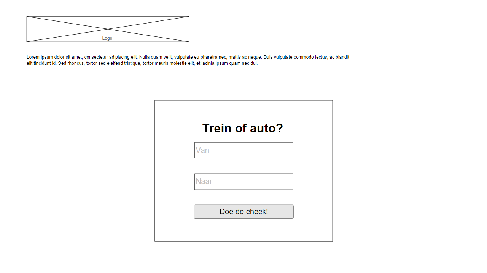
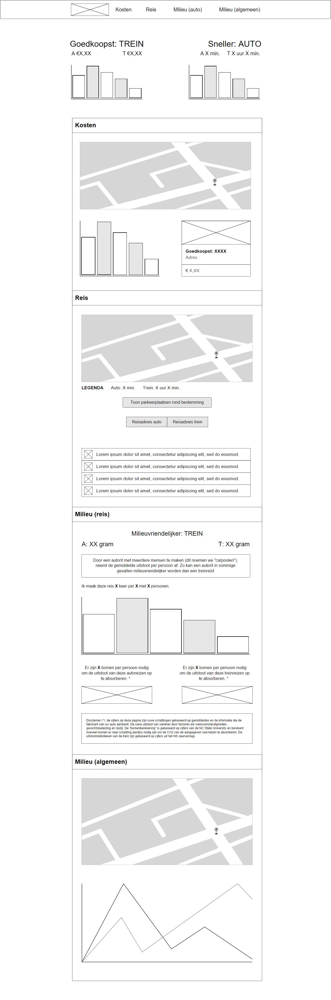
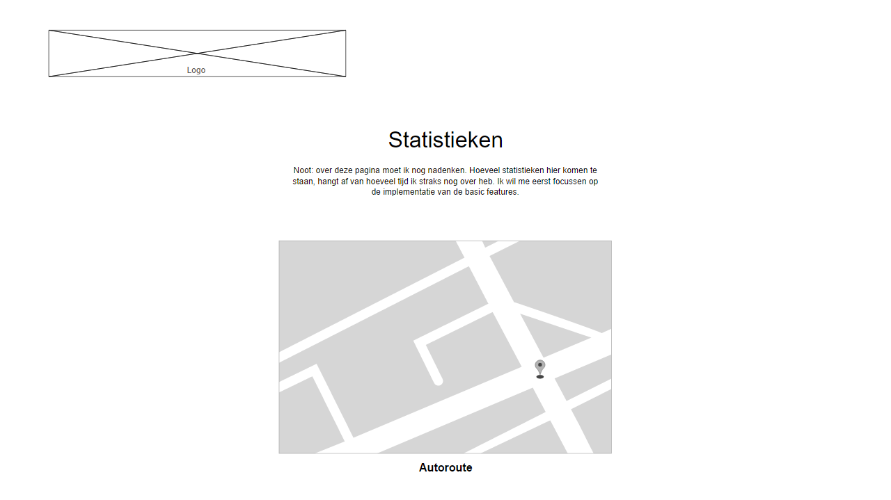

# Trein of Auto (treinofauto.nl)
Leon Kempers, 10626646 (Data Processing).

## Probleemdefinitie
We kennen het allemaal: met half dichtgeknepen oogjes kruip je 's ochtends uit bed en wanneer je de gordijnen opentrekt, zie je dat Nederland bedekt is onder een dik pak sneeuw. Je krijgt direct een vervelend gevoel in je onderbuik en wanneer je de tv aanzet, wordt je angst bevestigd: het is een chaos op zowel de weg als het spoor. Je hebt echter een belangrijke afspraak en moet zo snel mogelijk in Maastricht zijn. Waar kies je voor: de trein of de auto?

Of misschien heb je wel een dure maand gehad. Na de kerstcadeautjes voor je familie en die wintervoorraad drank voor oud en nieuw, moet je concluderen dat je nog heel veel maand overhebt an het einde van je geld. Waar kies je voor als budgetbewuste reiziger: de trein of de auto?

De webapplicatie "Trein of Auto" is bedoeld om antwoord te geven op deze vragen. Je geeft je beginlocatie en eindbestemming op en op basis van de huidige benzineprijzen en NS-gegevens berekent de applicatie automatisch wat goedkoper en/of sneller is: de auto of de trein.

## Wireframes
Hieronder volgen wireframes van de drie pagina's, zoals beschreven in de paragraaf "Delen van de applicatie".

### Startscherm

### Resultatenscherm

### Detailscherm

## Benodigde datasets
Benodigde API's:
* [NS API] (http://www.ns.nl/reisinformatie/ns-api): Om de prijs en duur van de treinreis op te halen.
* [Google Maps API] (https://developers.google.com/maps/): Om de afstand en duur van de autoroute op te halen.

Benodigde datasets:
* [Fuel Economy Data] (https://www.fueleconomy.gov/feg/download.shtml): Officiële verzameling datasets van de Amerikaanse overheid. Toont van vrijwel elk voertuig in de wereld het brandstofverbruik in "miles per gallon" (kan omgerekend worden naar "liter per 100 km") en het type benzine. Ik zal de verschillende datasets (ze zijn gescheden per jaar) combineren en uitlezen met PHP.
* [United Consumers] (https://www.unitedconsumers.com/tanken/informatie/brandstof-prijzen.asp): Actuele brandstofprijzen</a>: Helaas is er voor Nederland geen dataset of API waarmee de huidige brandstofprijs opgehaald kan worden. Daarom ben ik genoodzaakt deze prijs te crawlen van een webpagina. Voor mijn applicatie gebruik ik de pagina van United Consumers, omdat die de meest uitgebreide informatie toont (namelijk ook de prijzen per benzinestation).

## Delen van de applicatie
De applicatie bestaat uit drie delen:
* Het startscherm, waarin de gebruiker zijn beginbestemming en eindlocatie opgeeft.
* Het resultatenscherm, die in één oogopslag toont welke optie het goedkoopst is en welke het snelst is.
* Het detailscherm, met daarin visualisaties van de reisduur, de prijs en eventueel de route.

## Platform en API's
Ik verwacht dat ik het grootste deel van de applicatie zal schrijven in PHP, al heb ik ook HTML en CSS nodig voor de website. De visualisaties wil ik implementeren met D3, dus daarvoor heb ik JavaScript nodig. Zoals hierboven beschreven zal ik de NS API en de Google Maps API gebruiken.

## Potentiële problemen
Ik voorzie momenteel twee potentiële problemen:
* **Het gebruik van de NS API.** Ik heb nog nooit gewerkt met een API als deze, dus hier zal ik veel uitzoekwerk voor moeten uitvoeren.
* **Het ophalen van de brandstofgegevens per auto en deze combineren met de brandstofprijzen.** In de dataset van de Amerikaanse overheid staan duizenden auto's en van al deze auto's is ontzettend veel informatie opgeslagen. Ik zal deze dataset dus flink moeten opschonen en het wordt waarschijnlijk ook een uitdaging om deze gegevens te combineren met de real-time brandstofprijzen. Echter, als ik blijf proberen en indien nodig hulp vraag, verwacht ik dat ik er wel uit moet komen.

## Gelijksoortige applicaties
Er is momenteel geen website als "Trein of Auto", al worden de twee onderdelen waar de applicatie in feite uit bestaat, wel los aangeboden:
* [NS.nl] (http://www.ns.nl/): Geeft de prijs en duur van een treinreis. Hier wordt cijfermatige data gegeven, maar er zijn geen visualisaties aanwezig.
* [Benzinekosten-berekenen.nl] (http://benzinekosten-berekenen.nl/): Staat je toe om de benzinekosten van je reis te berekenen. Ook hier geldt dat er geen visualisaties zijn; alle data is in de vorm van cijfers.
Door deze twee applicaties als het ware te "combineren" ontstaat nieuwe informatie. Nu kan de vraag "Wat is goedkoper: de auto of de trein?" namelijk snel en eenvoudig beantwoord worden! Bovendien zal "Trein of Auto" de gebruiker toestaan om zijn autotype in te geven, waarna de verbruiksgegevens automatisch worden opgehaald. Bij Benzinekosten-berekenen moet de gebruiker zelf het verbruik opzoeken en ingeven en dat is een stuk omslachtiger.