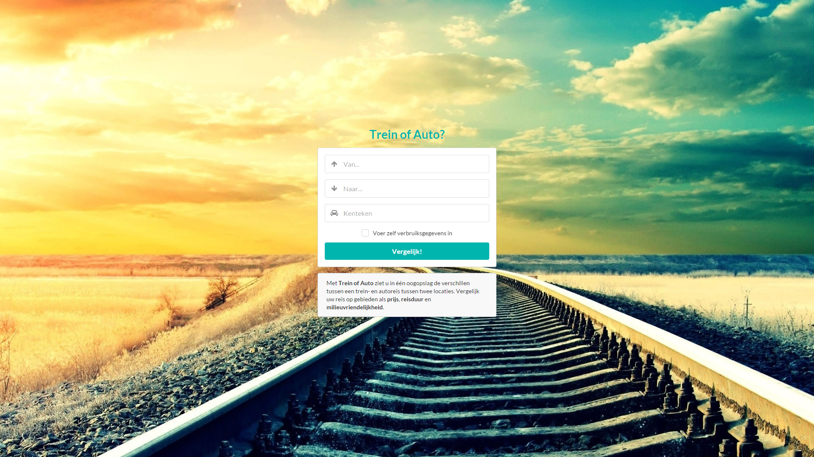
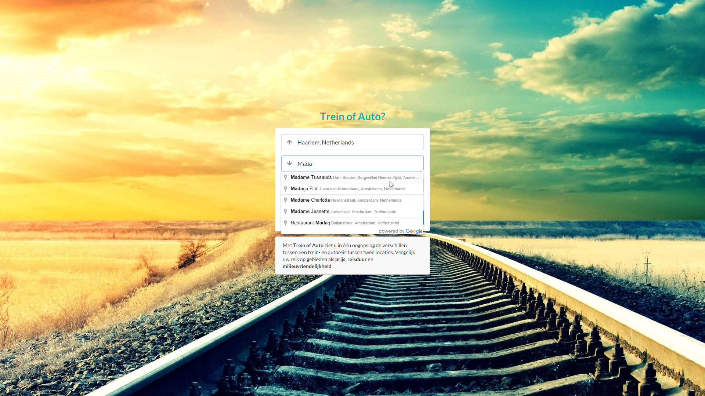
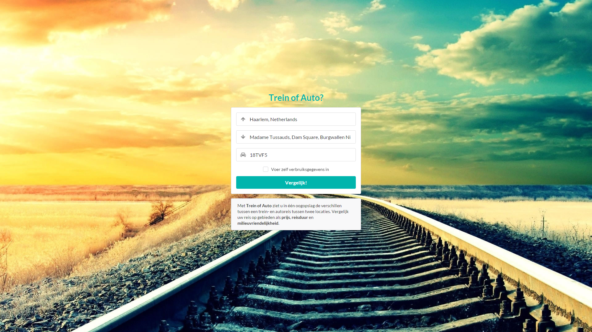
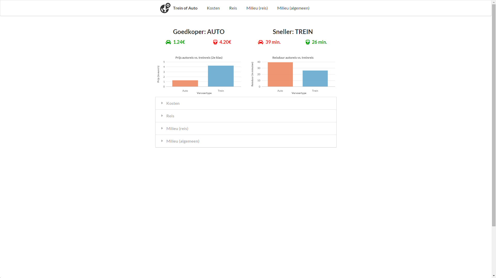
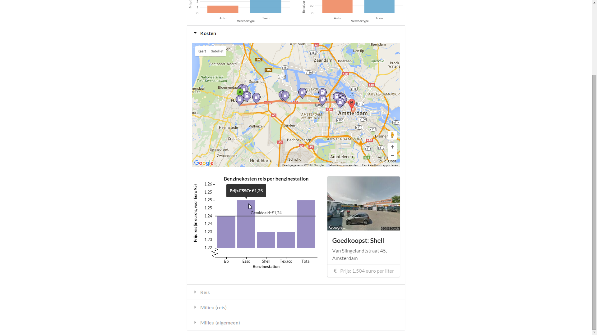
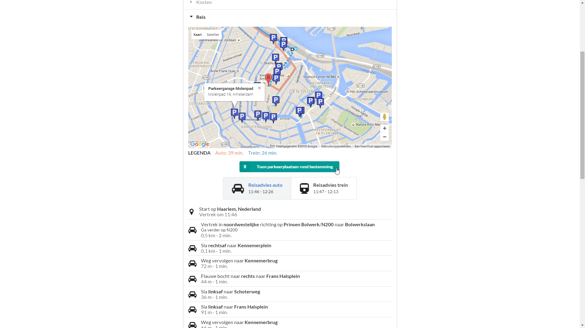
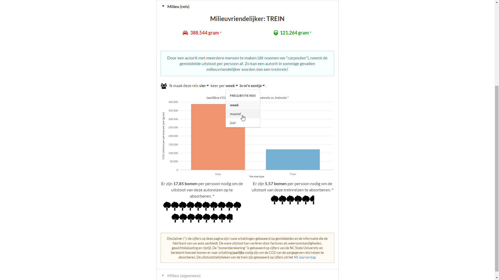
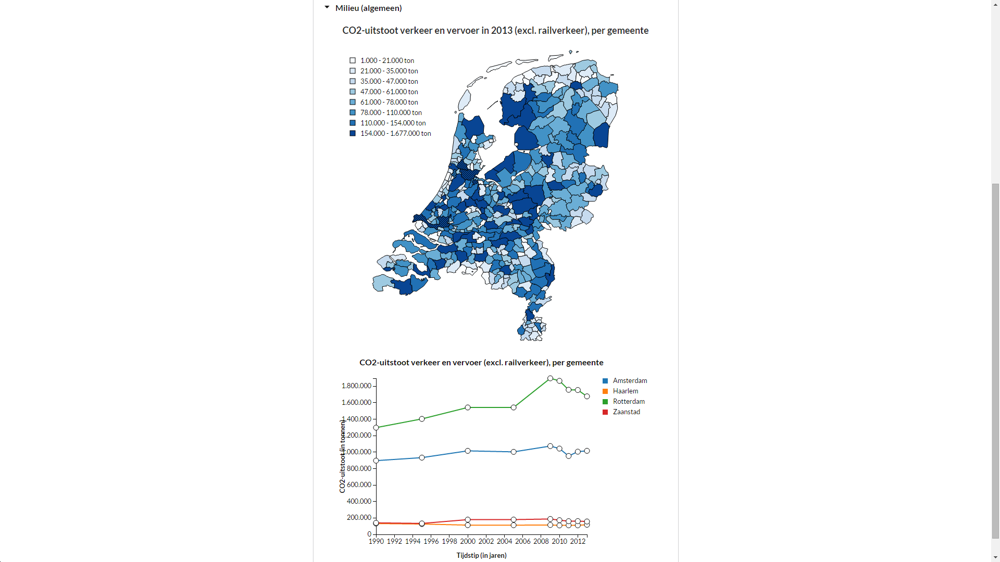

# Trein of Auto ([treinofauto.nl] (http://treinofauto.nl))
Leon Kempers, 10626646 (Data Processing).

## Probleemdefinitie
We kennen het allemaal: met half dichtgeknepen oogjes kruip je 's ochtends uit bed en wanneer je de gordijnen opentrekt, zie je dat Nederland bedekt is onder een dik pak sneeuw. Je krijgt direct een vervelend gevoel in je onderbuik en wanneer je de tv aanzet, wordt je angst bevestigd: het is een chaos op zowel de weg als het spoor. Je hebt echter een belangrijke afspraak en moet zo snel mogelijk in Maastricht zijn. Waar kies je voor: de trein of de auto?

Of misschien heb je wel een dure maand gehad. Na de kerstcadeautjes voor je familie en die wintervoorraad drank voor oud en nieuw, moet je concluderen dat je nog heel veel maand overhebt aan het einde van je geld. Waar kies je voor als budgetbewuste reiziger: de trein of de auto?

De webapplicatie **Trein of Auto** is bedoeld om antwoord te geven op deze vragen. Je geeft je beginlocatie en eindbestemming op en door verschillende databronnen te combineren, berekent de applicatie automatisch wat goedkoper en/of sneller is: de auto of de trein. Ook zie je direct wat de milieuvriendelijkste optie is, kun je de landelijke CO2-uitstoot vergelijken en het is zelfs mogelijk om de benzinestations op je route en parkeerplaatsen op je bestemming te zien!

**Waar je ook naartoe moet, elke reis begint met Trein of Auto!**

## Screenshots

## Copyright statement
Raadpleeg [LICENSE] (https://github.com/TheLeonKing/Programmeerproject/blob/master/LICENSE) voor een overzicht van de auteursrechten. *Please refer to [LICENSE] (https://github.com/TheLeonKing/Programmeerproject/blob/master/LICENSE) for information about the copyrighted material in this repository.*

## Delen van de applicatie
De applicatie bestaat uit drie delen:
* Het **startscherm**, waarin de gebruiker zijn beginbestemming, eindlocatie en nummerbord opgeeft. Ook kan de gebruiker hier desgewenst zelf de verbruiksgegevens van zijn auto invoeren, bijvoorbeeld als hij het nummerbord van zijn auto niet weet.
* Het **resultatenscherm**, dat onderverdeeld is in een stuk met "algemene" informatie en vier detailtabs. Omdat deze pagina uit meerdere delen bestaat en veel visualisaties bevat, heb ik deze hieronder gevisualiseerd in een overzichtelijk diagram.

## Wireframes
Hieronder volgen wireframes van de twee pagina's zoals beschreven in de paragraaf "Delen van de applicatie".

### Startscherm

### Resultatenscherm
