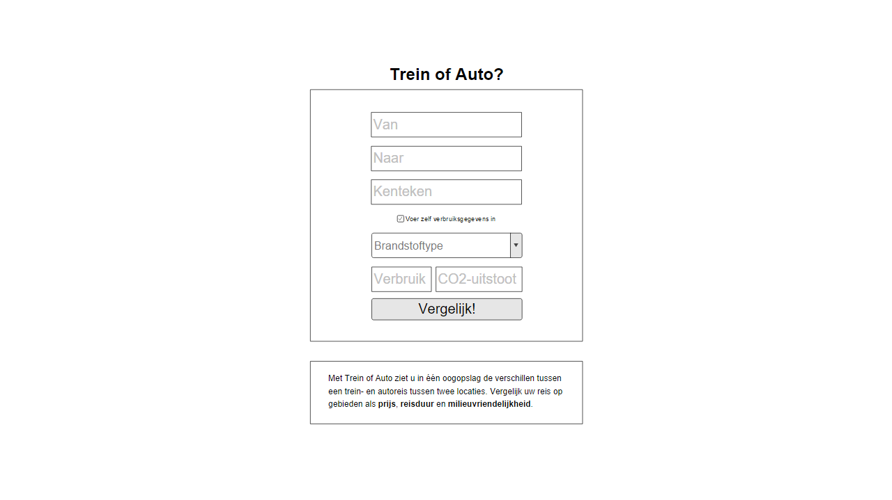

# Trein of Auto (treinofauto.nl)
Leon Kempers, 10626646 (Data Processing).

## Probleemdefinitie
We kennen het allemaal: met half dichtgeknepen oogjes kruip je 's ochtends uit bed en wanneer je de gordijnen opentrekt, zie je dat Nederland bedekt is onder een dik pak sneeuw. Je krijgt direct een vervelend gevoel in je onderbuik en wanneer je de tv aanzet, wordt je angst bevestigd: het is een chaos op zowel de weg als het spoor. Je hebt echter een belangrijke afspraak en moet zo snel mogelijk in Maastricht zijn. Waar kies je voor: de trein of de auto?

Of misschien heb je wel een dure maand gehad. Na de kerstcadeautjes voor je familie en die wintervoorraad drank voor oud en nieuw, moet je concluderen dat je nog heel veel maand overhebt an het einde van je geld. Waar kies je voor als budgetbewuste reiziger: de trein of de auto?

De webapplicatie "Trein of Auto" is bedoeld om antwoord te geven op deze vragen. Je geeft je beginlocatie en eindbestemming op en door verschillende databronnen te combineren, berekent de applicatie automatisch wat goedkoper en/of sneller is: de auto of de trein.

## Delen van de applicatie
De applicatie bestaat uit drie delen:
* Het **startscherm**, waarin de gebruiker zijn beginbestemming, eindlocatie en nummerbord opgeeft. Ook kan de gebruiker hier desgewenst zelf de verbruiksgegevens van zijn auto invoeren, bijvoorbeeld als hij het nummerbord van zijn auto niet weet.
* Het **resultatenscherm**, dat onderverdeeld is in een stuk met "algemene" informatie en vier detailtabs. Omdat deze pagina uit meerdere delen bestaat en veel visualisaties bevat, heb ik deze hieronder gevisualiseerd in een overzichtelijk diagram.

## Wireframes
Hieronder volgen wireframes van de twee pagina's zoals beschreven in de paragraaf "Delen van de applicatie".

### Startscherm

### Resultatenscherm

## Benodigde API's en datasets
De benodigde API's en datasets worden beschreven in het Design-document.

## Platform
Het grootste deel van "Trein of Auto" is geschreven in JavaScript. Daarnaast werd uiteraard HTML en CSS gebruikt om de webpagina's te visualiseren. De benzineprijzen werden opgehaald door middel van PHP.

## Potentiële problemen
Ik voorzie momenteel twee potentiële problemen:
* **Het gebruik van de NS API.** Ik heb nog nooit gewerkt met een API als deze, dus hier zal ik veel uitzoekwerk voor moeten uitvoeren.
** *Opmerking achteraf: omdat bleek dat het prijzencomponent van de NS API een contract vereist (dat een lange aanvraagperiode heeft), heb ik de NS API niet gebruikt. Omdat ik er toch mee wilde oefenen, heb ik wel code geschreven waarmee ik succesvol reisinformatie uit de NS API kan opvragen; deze is te vinden in eerdere commits (van begin week 3). Omdat ik uiteindelijk Google Maps heb gebruikt voor deze reisinformatie, zijn de NS API-functies niet in de uiteindelijke code te vinden.*
* **Het ophalen van de brandstofgegevens per auto en deze combineren met de brandstofprijzen.** In de dataset van de Amerikaanse overheid staan duizenden auto's en van al deze auto's is ontzettend veel informatie opgeslagen. Ik zal deze dataset dus flink moeten opschonen en het wordt waarschijnlijk ook een uitdaging om deze gegevens te combineren met de real-time brandstofprijzen. Echter, als ik blijf proberen en indien nodig hulp vraag, verwacht ik dat ik er wel uit moet komen.
** *Opmerking achteraf: ik heb uiteindelijk niet de dataset van de Amerikaanse overheid gebruikt omdat de gegevens van de RDW veel relevanter waren voor een Nederlandse website. Het was inderdaad een uitdaging om de autogegevens te combineren met de brandstofprijzen, maar zoals ik zelf al aangaf: na veel proberen en doorzetten is het me toch gelukt.*

## Gelijksoortige applicaties
Er is momenteel geen website als "Trein of Auto", al worden de twee onderdelen waar de applicatie in feite uit bestaat, wel los aangeboden:
* [NS.nl] (http://www.ns.nl/): Geeft de prijs en duur van een treinreis. Hier wordt cijfermatige data gegeven, maar er zijn geen visualisaties aanwezig.
* [Benzinekosten-berekenen.nl] (http://benzinekosten-berekenen.nl/): Staat je toe om de benzinekosten van je reis te berekenen. Ook hier geldt dat er geen visualisaties zijn; alle data is in de vorm van cijfers.
Door deze twee applicaties als het ware te "combineren" ontstaat nieuwe informatie. Nu kan de vraag "Wat is goedkoper: de auto of de trein?" namelijk snel en eenvoudig beantwoord worden! Bovendien staat "Trein of Auto" de gebruiker toe om zijn autotype in te geven, waarna de verbruiksgegevens automatisch worden opgehaald. Bij Benzinekosten-berekenen.nl moet de gebruiker zelf het verbruik opzoeken en ingeven en dat is een stuk omslachtiger.